# Gist

A Chrome extension that streams plain-English explanations of highlighted text, then turns everything you save into a searchable knowledge base.

[](https://developer.chrome.com/docs/extensions/mv3/)
[](https://www.typescriptlang.org/)
[](https://fastapi.tiangolo.com/)
[](https://groq.com/)
[](https://ai.google.dev/)
[](https://www.mongodb.com/atlas)
[](LICENSE)

---

## What It Is

Reading something dense on the web usually means copying the text, opening a new tab, pasting it somewhere, and then trying to find your place again. Gist skips that. Highlight any text, press `Ctrl+Shift+E`, and a plain-English explanation streams onto the page in about half a second.

Everything you save is stored with a vector embedding and a few generated tags. Over time the library turns into something you can search in plain language, review as flashcards, or browse as a graph of related notes.

**Live backend:** https://parthiv-2006-gist-backend.hf.space (Hugging Face Spaces on Docker)

---

## Onboarding

<table>
<tr>
<td align="center">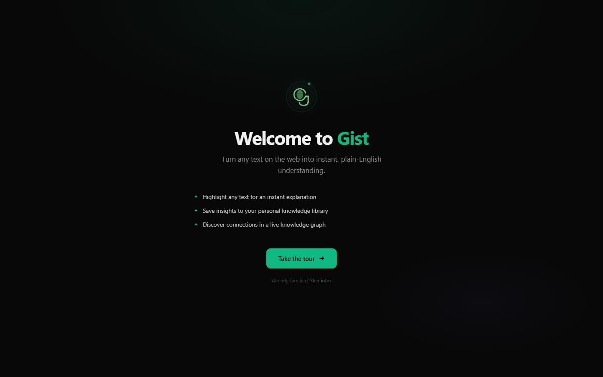<br/><sub>Welcome</sub></td>
<td align="center">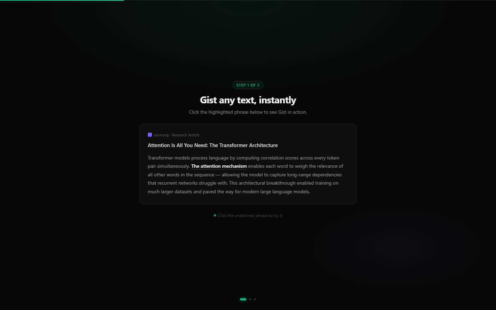<br/><sub>Highlight & explain</sub></td>
<td align="center">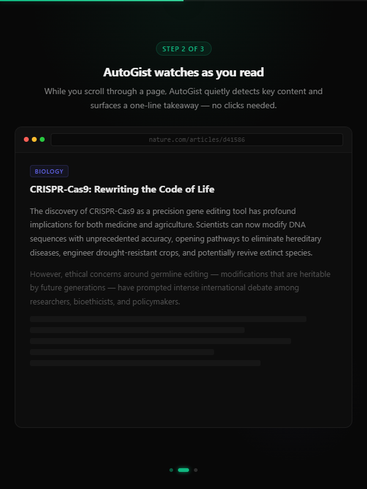<br/><sub>AutoGist</sub></td>
<td align="center">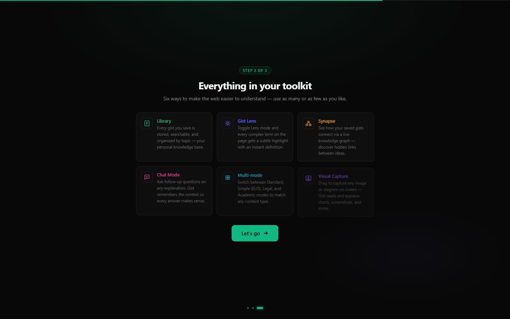<br/><sub>Features overview</sub></td>
<td align="center">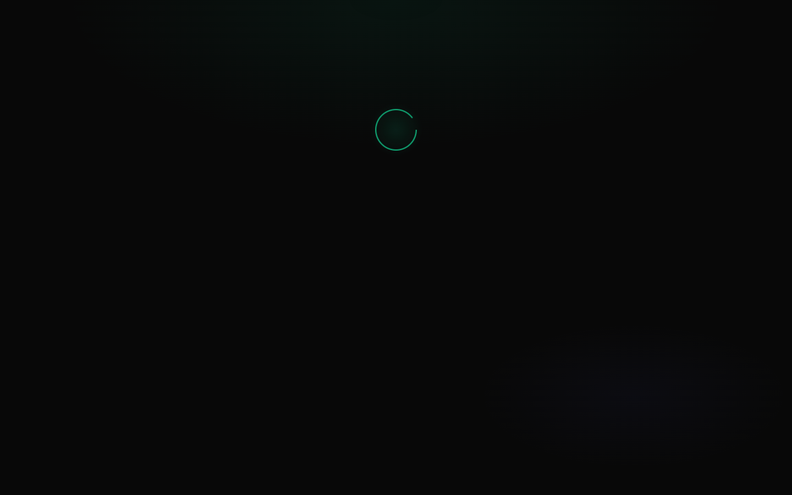<br/><sub>Ready to go</sub></td>
</tr>
</table>

---

## Features

<table>
<tr>
<td align="center" width="50%"><br/><sub><b>Streaming explanation.</b> Text renders word by word inside a Shadow DOM popover, isolated from the host page's CSS.</sub></td>
<td align="center" width="50%">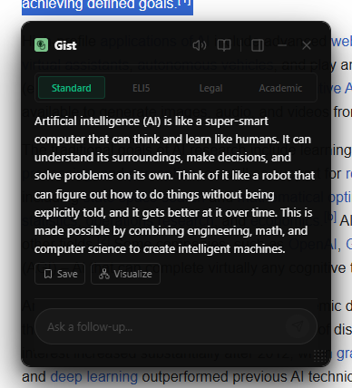<br/><sub><b>Done state.</b> Save to the library, open a follow-up chat, or draw a concept map.</sub></td>
</tr>
<tr>
<td align="center">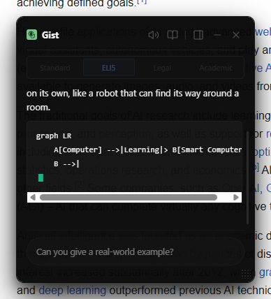<br/><sub><b>Explanation modes.</b> Standard, ELI5, Legal, and Academic each use a different prompt. The active mode sticks across sessions.</sub></td>
<td align="center">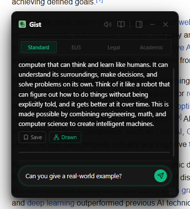<br/><sub><b>Follow-up chat.</b> Each request carries the full conversation history, capped at 20,000 characters on the server.</sub></td>
</tr>
<tr>
<td align="center">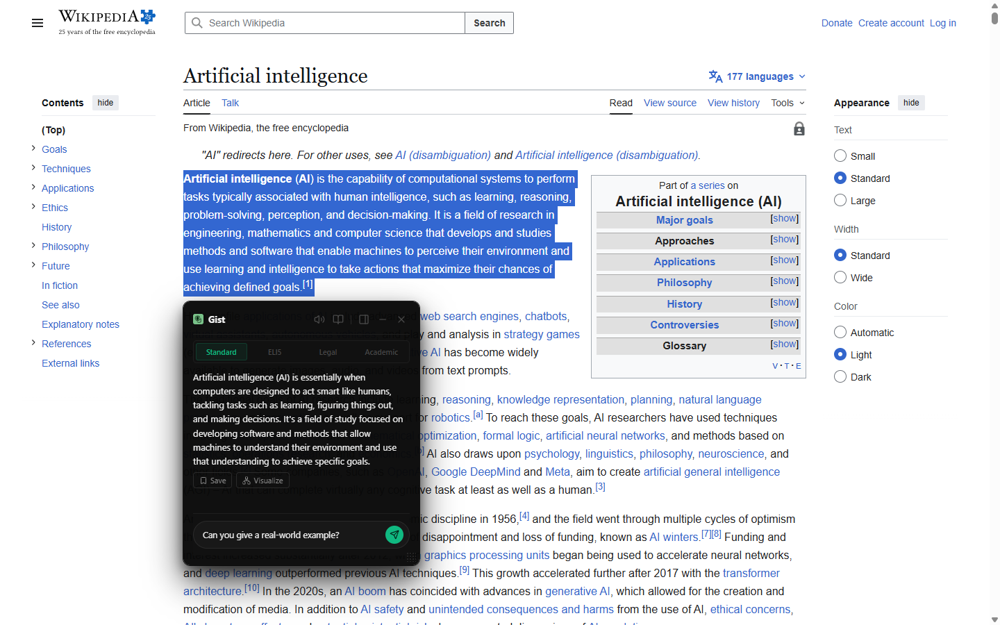<br/><sub><b>Progressive disclosure.</b> Double-click any word to drill into a nested definition. Breadcrumbs track up to 10 levels.</sub></td>
<td align="center"><br/><sub><b>Mermaid diagram.</b> The model writes a flowchart, which the backend sanitizes and renders through mermaid.ink.</sub></td>
</tr>
<tr>
<td align="center">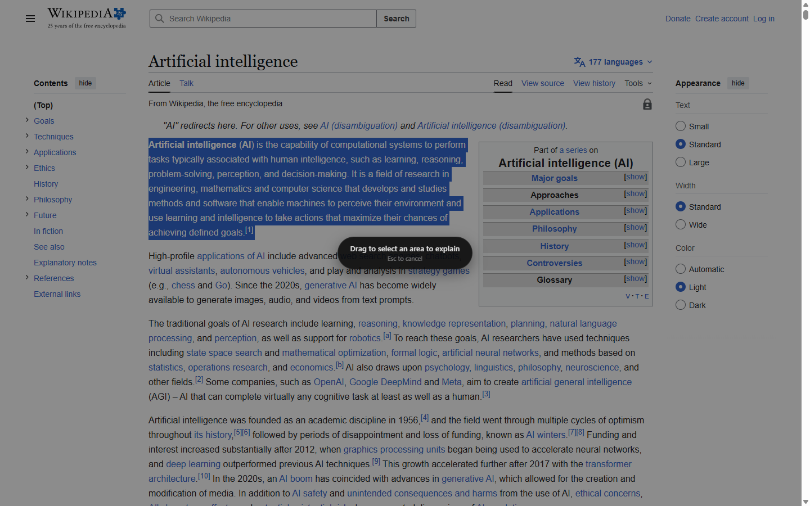<br/><sub><b>Visual capture.</b> <code>Alt+Shift+G</code> opens a drag-to-select overlay. The background worker crops the region and sends it as image input.</sub></td>
<td align="center">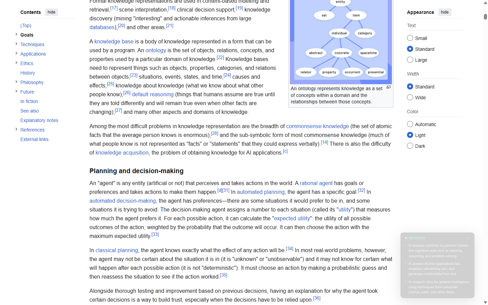<br/><sub><b>AutoGist.</b> An IntersectionObserver summarizes new content as you scroll, with an 8-second per-tab cooldown.</sub></td>
</tr>
<tr>
<td align="center">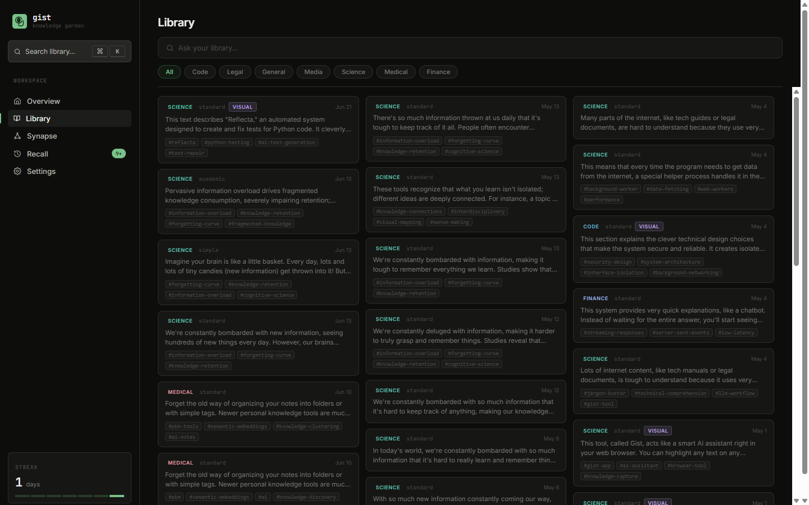<br/><sub><b>Gist Library.</b> A grid of saved explanations with category badges, tags, and keyword filtering.</sub></td>
<td align="center">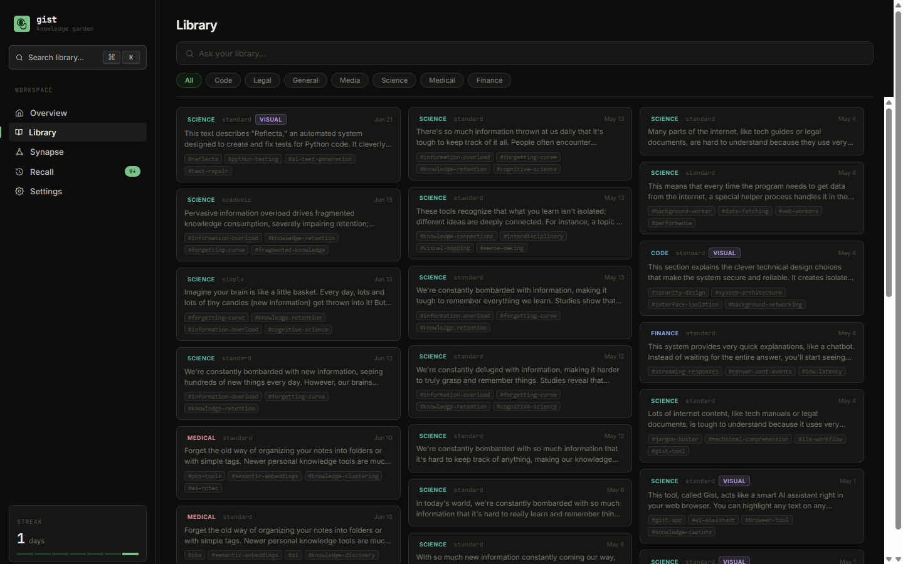<br/><sub><b>Split-pane detail.</b> Source URL, original text, full explanation, recall status, and a chat box, all in one pane.</sub></td>
</tr>
<tr>
<td align="center">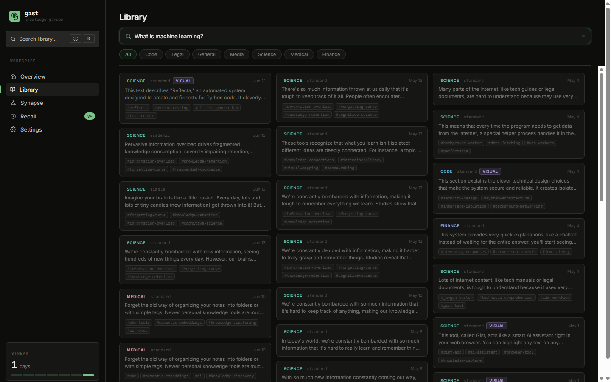<br/><sub><b>Semantic search.</b> Your query is embedded, matched against stored vectors, and answered from the top five notes.</sub></td>
<td align="center">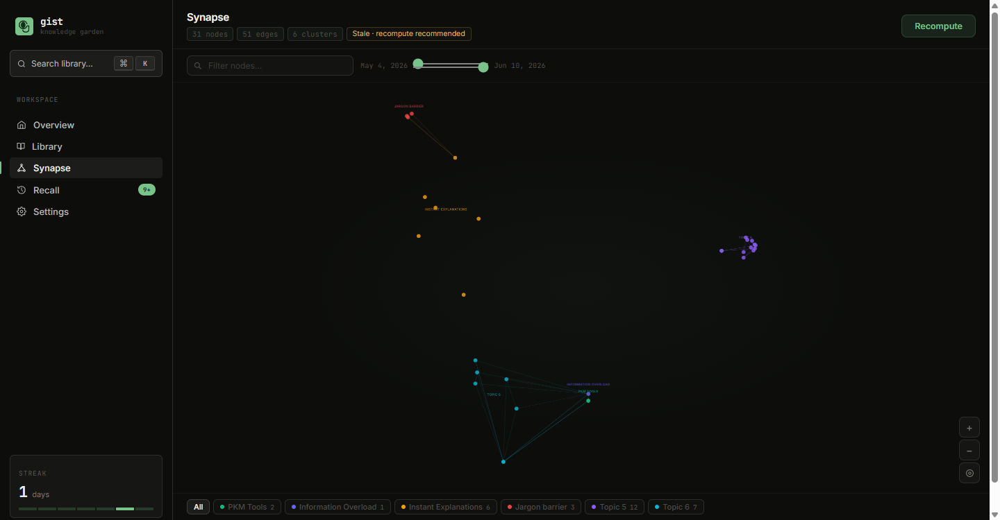<br/><sub><b>Synapse graph.</b> Embeddings projected to 2D with PCA, clustered with KMeans, and labeled by topic.</sub></td>
</tr>
<tr>
<td align="center">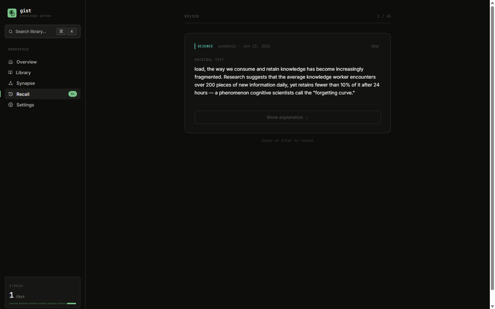<br/><sub><b>Recall flashcards.</b> A front/back card for each gist, surfaced on a spaced-repetition schedule.</sub></td>
<td align="center">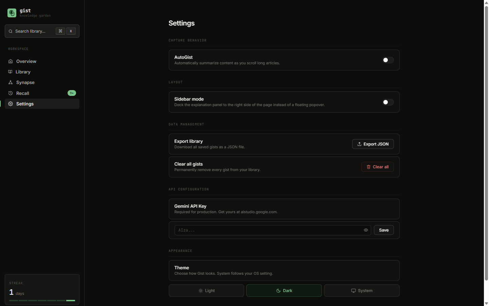<br/><sub><b>Settings.</b> Personal API key, dark/light/system theme, and an AutoGist toggle.</sub></td>
</tr>
</table>

---

## Tech Stack

| Layer | Technology |
|-------|------------|
| Extension language | TypeScript 5.9 (strict) |
| Extension UI | React 19, CSS Modules |
| Extension build | Vite 8, two separate configs (content IIFE + popup/background) |
| Extension testing | Vitest 4, Testing Library, jsdom |
| Backend framework | FastAPI 0.110 |
| Database | MongoDB Atlas via Motor 3 |
| Text generation | Groq (`llama-3.3-70b-versatile`), with Google Gemini 2.5 Flash as a fallback |
| Embeddings | Gemini `gemini-embedding-001` (3072 dims) |
| Compute | NumPy 1.26 (PCA via SVD, KMeans via Lloyd's, cosine similarity) |
| Diagrams | mermaid.ink (server-side SVG render) |
| Rate limiting | SlowAPI 0.1.9 |

---

## Architecture

```
Chrome Extension (MV3)                      FastAPI Backend
TypeScript · React 19 · Vite 8              Python 3.11 · Uvicorn · Motor · SlowAPI

  Content Script                              POST /api/v1/simplify    SSE stream
    Text selection detection                  POST /api/v1/visualize   SVG
    IntersectionObserver (AutoGist)           POST /api/v1/nested-gist
    Shadow DOM popover (z: 2147483647)        POST /autogist
          |                                   GET|POST /library
          | chrome.runtime messages           DELETE /library/{id}
          v                                   POST /library/ask        RAG
  Background Service Worker                   POST|PUT|DELETE /library/{id}/recall
    All fetch() calls                         GET /synapse/graph
    SSE stream relay                          POST /synapse/compute
    resolveBase(): localhost or HF Space               |
    Save with primary/fallback retry                   |
          |                                   MongoDB Atlas
          +-- HTTPS ----------------------->  gists collection
                                                embedding: float[3072]
                                                recall_card: nested doc
                                              synapse_cache collection
                                                graph: nodes + edges + clusters
```

The background service worker owns all network I/O because content scripts inherit the host page's Content Security Policy, which blocks cross-origin requests. Routing all `fetch()` calls through the service worker sidesteps this using only four manifest permissions (`contextMenus`, `scripting`, `activeTab`, `storage`).

The Gemini streaming path bridges two incompatible concurrency models: the `google-genai` SDK exposes a synchronous iterator; FastAPI's SSE route is an `async` generator. A daemon thread pushes each chunk into a `queue.Queue` and the async generator pulls from it via `loop.run_in_executor()`, yielding control back to the event loop between chunks.

---

## Getting Started

### Prerequisites

| Tool | Version | Notes |
|------|---------|-------|
| Node.js | 18+ | Extension build |
| Python | 3.11+ | Backend runtime |
| Google Gemini API key | Any | Free at [aistudio.google.com](https://aistudio.google.com/app/apikey). Used for embeddings |
| Groq API key | Any | Optional. Free at [console.groq.com](https://console.groq.com/keys). Handles text generation when set |
| MongoDB Atlas | Free tier | Optional. Library, Synapse, and Recall are disabled without it |

### Installation

```bash
# 1. Clone
git clone https://github.com/parthiv-2006/Gist.git
cd Gist

# 2. Backend
cd gist-backend
python -m venv venv
venv\Scripts\activate          # Windows
# source venv/bin/activate     # macOS / Linux
pip install -r requirements.txt

cp .env.example .env
# Edit .env: set GEMINI_API_KEY (and optionally GROQ_API_KEY, MONGODB_URI)

uvicorn app.main:app --reload --port 8000

# 3. Extension (separate terminal)
cd gist-extension
npm install
npm run build
```

In Chrome: navigate to `chrome://extensions`, enable **Developer mode**, click **Load unpacked**, and select `gist-extension/dist/`.

### Configuration

| Variable | Required | Description |
|----------|----------|-------------|
| `GEMINI_API_KEY` | Yes | Google Gemini API key. Used for embeddings, and for text when no Groq key is set |
| `GROQ_API_KEY` | No | Groq API key. When set, all text generation goes through Groq instead of Gemini |
| `GROQ_MODEL` | No | Groq model name; defaults to `llama-3.3-70b-versatile` |
| `MONGODB_URI` | No | MongoDB connection string; Library, Synapse, and Recall are disabled without it |
| `ALLOWED_ORIGINS` | No | Comma-separated CORS origins; defaults to `*` |
| `MOCK_LLM` | No | `true` for offline development with deterministic mock responses |
| `DEBUG` | No | `true` for verbose error tracebacks |

### Running Locally

```bash
# Backend
cd gist-backend && uvicorn app.main:app --reload --port 8000

# Extension (rebuild on file save)
cd gist-extension && npm run dev
```

Health check: `GET http://localhost:8000/health` → `{"status": "ok", "db": {"connected": true}}`

---

## Testing

```bash
# Backend
cd gist-backend
pytest -v
pytest --cov=app --cov-report=term-missing

# Extension
cd gist-extension
npm run test
npm run test:coverage
```

The backend has 12 pytest test files covering all routes and services. All Gemini API calls and MongoDB handles are mocked. Set `MOCK_LLM=true` to run the full SSE path locally without consuming Gemini quota.

---

## Known Limitations

- **Chrome and Chromium only.** Firefox support would need a `browser` namespace shim and testing against Firefox's stricter content script CSP defaults.
- **Synapse needs at least 4 embedded gists.** The KMeans minimum cluster count is 4. Gists saved before embeddings existed need a manual `POST /library/backfill`.
- **Atlas Vector Search needs a paid cluster.** The numpy cosine fallback works on free-tier Atlas but loads up to 500 documents into memory per query.
- **No image compression before upload.** Visual Capture sends the full viewport PNG as base64, usually 2 to 4 MB at 1440×900.

---

## Project Structure

```
Gist/
├── gist-backend/
│   └── app/
│       ├── main.py                      App factory, CORS, security headers
│       ├── routes/
│       │   ├── simplify.py              POST /api/v1/simplify, SSE with first-chunk error probe
│       │   ├── library.py               CRUD plus concurrent embed/tag on save
│       │   ├── search.py                RAG: Atlas $vectorSearch with numpy cosine fallback
│       │   ├── synapse.py               Graph pipeline (PCA, KMeans, cosine edges)
│       │   ├── recall.py                Flashcard CRUD
│       │   ├── autogist.py              Viewport summarizer
│       │   ├── nested.py                Progressive disclosure definitions
│       │   └── visualize.py             Mermaid generation plus mermaid.ink render
│       └── services/
│           ├── gemini.py                Streaming thread bridge, embed, tags, recall cards
│           ├── synapse.py               Pure numpy: PCA, KMeans, cosine edges
│           └── categorize.py            Keyword-hit categorizer (no LLM, no latency)
└── gist-extension/
    ├── public/manifest.json             MV3 manifest (4 permissions, 2 keyboard commands)
    └── src/
        ├── background/index.ts          Service worker: all fetch(), SSE relay, resolveBase()
        ├── content/
        │   ├── shadow-host.ts           Shadow DOM mount and React root
        │   └── components/Popover.tsx   Main explanation UI (all states)
        ├── onboarding/                  5-step onboarding flow
        └── popup/
            ├── Dashboard.tsx            Sidebar navigation
            └── views/                   Home, Library, Synapse, Recall, Settings
```

---

## License

MIT License. See [LICENSE](LICENSE) for details.

---

<div align="center">

Built by <a href="https://github.com/parthiv-2006">parthiv-2006</a>

</div>
