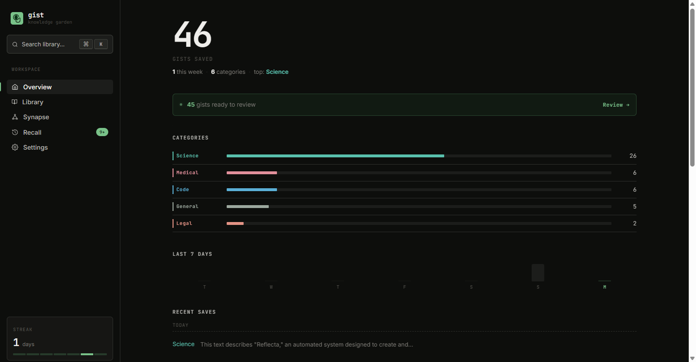

# Gist

A Chrome extension that streams plain-English explanations of any highlighted text, then builds a searchable, visualizable knowledge base from everything you save.

[](https://developer.chrome.com/docs/extensions/mv3/)
[](https://www.typescriptlang.org/)
[](https://fastapi.tiangolo.com/)
[](https://ai.google.dev/)
[](https://www.mongodb.com/atlas)
[](LICENSE)


---

## What It Is

Reading dense text on the web breaks focus constantly. You hit a legal clause you don't understand, a jargon-heavy research finding, or a code comment with assumed context, and the standard fix is copy, new tab, paste, read, try to find your place again. Gist collapses that loop: highlight any text, press `Ctrl+Shift+E`, and a streaming explanation appears directly on the page in under 500ms.

The knowledge layer is what separates this from a simple AI tooltip. Each saved explanation gets embedded as a 3072-dimensional vector via `gemini-embedding-001`, keyword-categorized, and AI-tagged. Over time the library becomes queryable with natural language via retrieval-augmented generation, studyable as auto-generated flashcards, and visualizable as a PCA-projected, KMeans-clustered graph where nodes are saved concepts and edges connect semantically similar ones at a cosine similarity threshold of 0.72.

---

## Demo

**Live backend:** https://gist-vc8m.onrender.com (Render free tier — expect a ~30s cold start after inactivity)

**Demo video** — full user flow in under 90 seconds:

https://github.com/parthiv-2006/Gist/releases/download/v1.0.0/demo.mp4

> **TODO:** Replace the URL above with the actual GitHub Release asset link after uploading the video.

---

## Screenshots

> **TODO:** Replace each placeholder below with a real screenshot. Capture at 1440x900 for desktop views and 390x844 for mobile. Store all files in `.github/assets/screenshots/`.

### Popover — Streaming Explanation

The popover mounts inside a Shadow DOM at `z-index 2147483647`; host-page stylesheets have no effect on it, regardless of whether the page uses a CSS reset or aggressive global rules.

### Popover — Done State

After the stream completes, the user can save to the library, open a follow-up chat, or generate a Mermaid concept map from the explanation.

### Follow-up Chat

Subsequent turns include the full conversation history in the Gemini request. The model retains context across questions without any session state on the server.

### Explanation Modes

Four modes map to distinct system instructions injected at prompt-build time: plain English (Standard), analogy-heavy simplification (ELI5), rights-and-obligations summary (Legal), and scholarly argument extraction (Academic).

### Visual Capture

`Alt+Shift+G` activates a drag-to-select overlay. The background worker calls `chrome.tabs.captureVisibleTab`, crops the capture to the selected region, base64-encodes the PNG, and sends it as a multimodal `inline_data` part alongside the text prompt.

### Mermaid Diagram

Gemini generates `flowchart TD` syntax; the backend sanitizes it (square-bracket labels and stray double-quote characters break the mermaid.ink parser), base64-encodes the result, and fetches the rendered SVG. If both the raw and sanitized fetch attempts fail, the extension shows the raw Mermaid source as a code block.

### Progressive Disclosure

Double-clicking any word in an explanation sends a `NESTED_GIST_REQUEST`. Definitions stack into a breadcrumb-navigable trail capped at 10 levels; clicking any breadcrumb restores that level's content.

### Gist Library — Grid View

Each card shows the source URL, category badge, AI-generated tags, and a truncated explanation. The grid supports keyword filtering and category facets.

### Gist Library — Split-Pane Detail

Clicking a card opens the detail pane inline. The pane includes the source URL, original text, full explanation, recall card status, and a "Chat with this Gist" input.

### Semantic Search

The query is embedded and matched against stored vectors. Gemini synthesizes an answer from the top 5 retrieved notes and cites which notes its response draws from.

### Synapse Knowledge Graph

Nodes are PCA-projected 3072-dimensional embeddings scaled to a 1000x1000 canvas. KMeans cluster count is `max(4, min(12, round(sqrt(n))))`. Cluster labels are generated in parallel by Gemini.

### Recall Flashcards

Gemini generates a `{"front": "...", "back": "..."}` JSON card for each gist. The Recall view surfaces cards on a spaced-repetition schedule and supports user-edited custom cards.

### AutoGist Widget

An `IntersectionObserver` in the content script detects when the user scrolls to new content. A per-tab 8-second cooldown in the background service worker prevents rapid-fire requests.

### Full Dashboard

The popup opens as a full tab when triggered from the Library button. Sidebar navigation covers Home (activity heatmap, category breakdown), Library, Synapse, Recall, and Settings.

### Settings

Users can enter a personal Gemini API key sent as `X-Gemini-Api-Key` on every request, choose dark/light/system theme, and opt in to AutoGist.

### Dashboard — Mobile

The dashboard layout adapts to 390px-wide viewports for use in popup mode.

---

## Features

- **SSE streaming:** the backend probes the first chunk before committing to a `StreamingResponse`, so API errors still return structured JSON with error codes (`API_KEY_INVALID`, `QUOTA_EXCEEDED`, `LLM_TIMEOUT`) instead of broken partial streams
- **Four explanation modes:** Standard, ELI5, Legal, and Academic each map to a distinct instruction string in `_MODE_INSTRUCTIONS`; the active mode persists in `chrome.storage.local` across sessions
- **Follow-up chat:** the Shadow DOM host accumulates conversation history and sends it as a `messages` array; the backend enforces a 20,000-character total cap to block history-stuffing attacks that could bypass per-message length limits
- **Visual Capture:** the background worker calls `chrome.tabs.captureVisibleTab`, crops the PNG to the selected region, base64-encodes it, and sends it as a multimodal `inline_data` part alongside a standard text prompt
- **Progressive Disclosure:** double-clicking any word triggers a `NESTED_GIST_REQUEST`; results stack into a breadcrumb-navigable trail with a hard cap of 10 levels to prevent infinite recursion
- **Mermaid diagrams:** the backend extracts the diagram from any markdown fence, sanitizes square-bracket labels and double-quote characters, and fetches the SVG from mermaid.ink with one retry on the sanitized source; `svg: null` in the response signals the extension to fall back to the raw code block
- **Gist Library:** on save, `embed_text` and `generate_tags` run as concurrent `asyncio` tasks; embedding failure is logged and the document is saved without the vector field rather than failing the request
- **Semantic search (RAG):** the backend tries Atlas `$vectorSearch` with `numCandidates = top_k * 10` first; if the Atlas index is unavailable, it loads up to 500 documents and runs in-process cosine similarity via numpy, filtering results below a 0.3 score threshold
- **Auto-categorization:** a keyword-hit-count categorizer assigns one of six labels (Code, Legal, Medical, Finance, Science, General) synchronously on every save, adding no latency and no API cost
- **Synapse knowledge graph:** the numpy pipeline runs in a thread executor to keep the event loop free; cluster labels are generated in parallel via `asyncio.gather`; the result is upserted into `synapse_cache` and served directly on `GET /synapse/graph` without recomputation
- **Recall flashcards:** the route requests `{"front": "...", "back": "..."}` JSON from Gemini and uses a regex fallback to extract valid JSON when the model wraps output in markdown fences
- **AutoGist:** an `IntersectionObserver` fires on viewport changes; the service worker enforces an 8-second per-tab cooldown before forwarding to `/autogist`, and the server enforces 30 requests per minute globally
- **Security throughout:** user text is wrapped in XML delimiters (`<selected_text>`, `<page_title>`) to isolate it from system instructions; control characters and Unicode bidi overrides are stripped from cluster labels and tags; Mermaid SVGs pass through DOMPurify before rendering; the extension CSP is `script-src 'self'; object-src 'self'`

---

## Tech Stack

| Layer | Technology | Why |
|-------|-----------|-----|
| Extension language | TypeScript 5.9 (strict) | The `chrome.runtime` message protocol spans three isolated JS contexts (content, background, popup); strict types catch protocol mismatches at compile time, not at runtime |
| Extension UI | React 19, CSS Modules | CSS Modules scope styles to components by default; combined with Shadow DOM isolation, host-page stylesheets (including aggressive global resets) never reach the popover |
| Extension build | Vite 8, two separate configs | Content scripts load as isolated IIFE-compatible modules rather than ES module chunks; `vite.content.config.ts` handles the content entry independently from the popup/background build |
| Extension testing | Vitest 4, Testing Library, jsdom | Vitest shares the Vite config, so no separate Jest configuration is needed; jsdom makes Shadow DOM and React rendering testable without a real browser |
| Backend framework | FastAPI 0.110 | Async generators make SSE routing idiomatic in ASGI; Pydantic v2 `model_validator` carries custom error codes like `TEXT_TOO_LONG` directly out of validation without a separate translation layer |
| Database | MongoDB Atlas via Motor 3 | Motor is the only officially-supported async Python MongoDB driver; async I/O keeps all database reads off the event loop |
| AI / LLM | Google Gemini 2.5 Flash | Visual Capture requires multimodal input (text + image) in a single request; 2.5 Flash is the fastest tier that supports multimodal input at the free quota level |
| Embeddings | gemini-embedding-001 (3072 dims) | First-party embedding model; 3072 dimensions provide enough cosine separation for short web excerpts without exceeding MongoDB document size limits |
| Compute | NumPy 1.26 | PCA via `numpy.linalg.svd` (economy mode), KMeans via Lloyd's algorithm (seeded RNG, deterministic), and cosine similarity as a matrix multiply of L2-normalized vectors; no scikit-learn dependency |
| Diagrams | mermaid.ink (external render service) | Client-side Mermaid rendering inside a Shadow DOM is fragile due to the library's global state model; mermaid.ink renders server-side and returns a clean SVG, keeping the extension bundle lean |
| Rate limiting | SlowAPI 0.1.9 | Starlette-native; per-route `@limiter.limit("N/minute")` decorators live alongside the route definition rather than in middleware configuration |
| Deployment | Render free tier | `render.yaml` pins the build to `requirements.lock` for reproducible deploys; the `healthCheckPath` warms the Python process before traffic routes to it |

---

## Architecture

```
Chrome Extension (MV3)                      FastAPI Backend
TypeScript · React 19 · Vite 8              Python 3.11 · Uvicorn · Motor · SlowAPI

  Content Script                              POST /api/v1/simplify    SSE stream
    Text selection detection                  POST /api/v1/visualize   SVG
    IntersectionObserver (AutoGist)           POST /api/v1/nested-gist
    Shadow DOM popover (z: 2147483647)        POST /autogist
          |                                   GET|POST /library
          | chrome.runtime messages           DELETE /library/{id}
          v                                   POST /library/ask        RAG
  Background Service Worker                   POST|PUT|DELETE /library/{id}/recall
    All fetch() calls                         GET /synapse/graph
    SSE stream relay                          POST /synapse/compute
    resolveBase(): localhost or Render                 |
    Save with primary/fallback retry                   |
          |                                   MongoDB Atlas
          +-- HTTPS ----------------------->  gists collection
                                                embedding: float[3072]
                                                recall_card: nested doc
                                              synapse_cache collection
                                                graph: nodes + edges + clusters
```

The background service worker owns all network I/O for one reason: content scripts inherit the host page's Content Security Policy, which blocks cross-origin requests to any API the page does not explicitly permit. Routing all `fetch()` calls through the service worker sidesteps this constraint using only four manifest permissions (`contextMenus`, `scripting`, `activeTab`, `storage`), with no `host_permissions` entry needed.

The Gemini streaming path bridges two incompatible concurrency models. The `google-genai` SDK exposes a synchronous iterator. FastAPI's SSE route is an `async` generator. The solution: a daemon thread calls `client.models.generate_content_stream()` and pushes each chunk into a `queue.Queue`; the async generator pulls from the queue via `loop.run_in_executor()`, yielding control back to the event loop between chunks. A `threading.Event` signals the producer thread to stop early when the consumer exits (client disconnects, generator garbage-collected), stopping Gemini quota consumption mid-stream.

---

## How It Works

1. The user highlights text and presses `Ctrl+Shift+E`. The content script captures the selection, active mode, and page title, then sends a `GIST_REQUEST` message to the service worker via `chrome.runtime.sendMessage`.

2. The service worker calls `resolveBase()`, which probes `localhost:8000/health` with an 800ms abort timeout. If the local server is up and its database is connected, requests route to localhost; otherwise they go to the Render URL. The resolved URL is cached for 60 seconds.

3. The worker sends `POST /api/v1/simplify` with the text, mode, page context (truncated to 200 characters server-side), and optionally a base64-encoded PNG. Pydantic validates the payload: selected text is capped at 2,000 characters, total conversation history at 20,000.

4. Before committing to a `StreamingResponse`, the backend consumes the first chunk from the Gemini generator. If the generator raises immediately (invalid key, quota exhausted, timeout), the route returns a structured JSON error with the correct HTTP status code rather than starting a broken stream.

5. Once the first chunk arrives, each SSE line is formatted as `data: {"chunk": "..."}` and flushed. The service worker reads line by line, parses each `data:` payload, and forwards it as a `GIST_CHUNK` message to the content script. The Shadow DOM host appends each chunk to a React state string in the popover.

6. When the stream ends with `data: [DONE]`, the popover transitions to `DONE` state. The user can save (triggering concurrent embedding and tag generation on the backend), send a follow-up (full history is included in the next request), or request a Mermaid diagram.

7. On save, the backend runs `embed_text` and `generate_tags` as concurrent asyncio tasks. The 3072-dimensional embedding is stored alongside the document for future RAG queries. Category assignment is synchronous and keyword-based, adding no latency.

8. The Synapse compute pipeline loads up to 300 gists with embeddings (newest first), projects their embeddings to 2D via SVD-based PCA scaled to a 1000x1000 canvas, assigns KMeans clusters with count `max(4, min(12, round(sqrt(n))))`, computes cosine-similarity edges, and labels each cluster via parallel Gemini calls. The result is upserted into `synapse_cache`. Subsequent `GET /synapse/graph` requests return the cached result with a `stale` flag set when 5 or more new gists have been saved or 7 days have passed.

---

## Getting Started

### Prerequisites

| Tool | Version | Notes |
|------|---------|-------|
| Node.js | 18+ | Extension build |
| Python | 3.11+ | Backend runtime |
| Google Gemini API key | — | Free at aistudio.google.com/app/apikey |
| MongoDB Atlas | Free tier | Optional; disables Library, Synapse, and Recall without it |

### Installation

```bash
# 1. Clone
git clone https://github.com/parthiv-2006/Gist.git
cd Gist

# 2. Backend
cd gist-backend
python -m venv venv
venv\Scripts\activate          # Windows
# source venv/bin/activate     # macOS / Linux
pip install -r requirements.txt

cp .env.example .env
# Edit .env: set GEMINI_API_KEY (and optionally MONGODB_URI)

uvicorn app.main:app --reload --port 8000

# 3. Extension (separate terminal)
cd gist-extension
npm install
npm run build
```

In Chrome: navigate to `chrome://extensions`, enable **Developer mode**, click **Load unpacked**, and select `gist-extension/dist/`.

### Configuration

| Variable | Required | Description |
|----------|----------|-------------|
| `GEMINI_API_KEY` | Yes | Google Gemini API key |
| `MONGODB_URI` | No | MongoDB connection string; Library, Synapse, and Recall are disabled without it |
| `ALLOWED_ORIGINS` | No | Comma-separated CORS origins; defaults to `*`; set to `chrome-extension://YOUR_ID` in production |
| `MOCK_LLM` | No | `true` for offline development with deterministic, quota-free mock responses |
| `DEBUG` | No | `true` for verbose error tracebacks in server logs |

### Running Locally

```bash
# Backend
cd gist-backend && uvicorn app.main:app --reload --port 8000

# Extension (rebuild on file save)
cd gist-extension && npm run dev
```

Health check: `GET http://localhost:8000/health` returns `{"status": "ok", "db": {"connected": true}}`.

---

## Testing

```bash
# Backend (pytest + pytest-asyncio)
cd gist-backend
pytest -v
pytest --cov=app --cov-report=term-missing

# Extension (Vitest + Testing Library)
cd gist-extension
npm run test           # single run
npm run test:watch     # watch mode
npm run test:coverage  # with coverage report
```

The backend has 12 pytest test files: `test_health`, `test_simplify`, `test_simplify_edge_cases`, `test_library`, `test_nested`, `test_synapse_compute`, `test_synapse_routes`, `test_autogist`, `test_schemas`, `test_search`, `test_gemini_service`, and `test_visualize`. All Gemini API calls and MongoDB handles are mocked via `pytest-asyncio` fixtures and `pytest-httpx`. The `test_synapse_compute` suite is mock-free: it tests the pure numpy functions (`project_pca_2d`, `kmeans_cluster`, `compute_edges`, `choose_k`) directly against known inputs and expected outputs.

Set `MOCK_LLM=true` before starting the server to run the full SSE path locally without consuming any Gemini quota.

---

## Project Structure

```
Gist/
├── render.yaml                          Render deployment config (Python web service, pinned lockfile build)
├── gist-backend/
│   ├── requirements.txt                 Direct dependencies
│   ├── requirements.lock                Pinned lockfile for reproducible Render builds
│   └── app/
│       ├── main.py                      App factory, security headers middleware, CORS, router mounting
│       ├── db.py                        Motor connection manager with asyncio.wait_for timeout protection
│       ├── limiter.py                   SlowAPI limiter instance shared across routes
│       ├── models/schemas.py            Pydantic request schemas with custom error code validators
│       ├── routes/
│       │   ├── simplify.py              POST /api/v1/simplify — SSE stream with first-chunk error probe
│       │   ├── library.py               CRUD + concurrent embed/tag on save + tag aggregation
│       │   ├── search.py                RAG: Atlas $vectorSearch with numpy cosine fallback
│       │   ├── autogist.py              POST /autogist — viewport summarizer, JSON array extraction
│       │   ├── nested.py                POST /api/v1/nested-gist — progressive disclosure definitions
│       │   ├── visualize.py             POST /api/v1/visualize — Mermaid generation + mermaid.ink render
│       │   ├── synapse.py               GET/POST /synapse — graph pipeline with in-process rate limiting
│       │   └── recall.py                POST/PUT/DELETE /library/{id}/recall
│       ├── services/
│       │   ├── gemini.py                Prompt builder, streaming thread bridge, embed, tags, recall cards
│       │   ├── synapse.py               Pure numpy: PCA via SVD, KMeans (Lloyd's), cosine edge matrix
│       │   └── categorize.py            Keyword-hit-count categorizer, synchronous, no LLM call
│       └── tests/                       12 pytest test files, all external calls mocked
└── gist-extension/
    ├── public/manifest.json             MV3 manifest (4 permissions, 2 keyboard commands)
    ├── vite.config.ts                   Multi-entry build (background + popup + onboarding)
    ├── vite.content.config.ts           Separate IIFE build for the content script
    └── src/
        ├── background/index.ts          Service worker: all fetch(), SSE relay, resolveBase(), save fallback
        ├── content/
        │   ├── index.ts                 Text selection detection and inbound message routing
        │   ├── shadow-host.ts           Shadow DOM mount, React root, all popover state management
        │   ├── observer.ts              IntersectionObserver for AutoGist viewport tracking
        │   └── components/
        │       ├── Popover.tsx          Main explanation UI (streaming, chat, save, breadcrumbs, diagram)
        │       ├── AutoGistWidget.tsx   Ambient scroll summary widget
        │       ├── CaptureOverlay.tsx   Region selection overlay for visual capture
        │       └── Mermaid.tsx          SVG renderer with DOMPurify sanitization
        ├── popup/
        │   ├── App.tsx                  Popup entry and full-tab dashboard launcher
        │   ├── Dashboard.tsx            Sidebar navigation, activity streak tracking
        │   ├── tokens.ts                Design system tokens (oklch color palette, CSS custom properties)
        │   └── views/
        │       ├── HomeView.tsx         Activity heatmap, per-category metrics
        │       ├── LibraryView.tsx      Masonry grid, keyword search, split-pane detail panel
        │       ├── SynapseView.tsx      Canvas-based interactive knowledge graph
        │       ├── RecallView.tsx       Flashcard review with spaced repetition scheduling
        │       └── SettingsView.tsx     API key, theme, and AutoGist toggle configuration
        └── utils/
            ├── messages.ts              Typed chrome.runtime message protocol (all three contexts)
            ├── rate-limiter.ts          Client-side sliding window rate limiter
            └── text.ts                  Text selection and truncation utilities
```

---

## Known Limitations

- **Chrome/Chromium only.** Shadow DOM with `mode: "open"`, MV3 service workers, and `chrome.scripting.executeScript` are Chrome-specific APIs. Firefox support requires a `browser` namespace shim and validation against Firefox's stricter default CSP for extension pages.
- **Render free-tier cold starts.** The backend sleeps after 15 minutes of inactivity; the extension sends a warm-up ping to `/health` on install, but the first request after a cold start can take 20-30 seconds.
- **Synapse requires at least 4 embedded gists.** The KMeans implementation needs as many data points as the minimum cluster count (4). Gists saved before the embedding feature was added need a manual call to `POST /library/backfill` to generate vectors retroactively.
- **Atlas Vector Search requires a paid cluster.** Free-tier Atlas clusters do not support the `$vectorSearch` aggregation stage. The numpy cosine fallback works on any tier, but it loads up to 500 documents into memory per query rather than using a server-side index.
- **Synapse rate limit is per-process.** The 60-second recompute cooldown is a module-level variable that resets on every server restart. Render's free tier restarts frequently, which can allow faster recomputes than intended.
- **No image compression before upload.** Visual Capture sends the full viewport PNG as base64. A 1440x900 capture is typically 2-4 MB; there is no client-side resize or quality reduction step before encoding.
- **AutoGist client-side cooldown resets on service worker restart.** The 8-second per-tab cooldown resets whenever Chrome terminates and relaunches the service worker. The server-side limit (30 req/min) is the only persistent safeguard.

---

## What I Would Build Next

1. **Library export (JSON, Markdown, CSV).** The data model is fully normalized and export-ready; the missing piece is a `GET /library/export` endpoint and a download button in the dashboard. Data portability is the first question users ask about any personal knowledge tool.

2. **Automated embedding backfill on startup.** Gists saved before Phase 5 lack embeddings and are invisible to RAG search and Synapse. A background task that runs at startup and processes missing embeddings in batches of 20 would silently repair old data without requiring a manual API call.

3. **Incremental Synapse graph updates.** The current pipeline recomputes all positions from scratch on each call. New nodes could be projected into the existing PCA subspace (the principal component matrix is already available after the SVD call) and assigned to the nearest centroid, making the update instantaneous for small additions.

4. **Firefox support.** The core architecture is compatible with Firefox's WebExtensions API. The two concrete blockers are replacing `chrome.*` namespace calls with a browser shim and validating behavior against Firefox's stricter content script CSP defaults. The TypeScript config already flags non-standard Chrome API usage, so the migration surface is auditable.

5. **Multi-provider API key routing.** The backend already reads `X-Gemini-Api-Key` per request and passes it through to all Gemini calls. Extending the header scheme to accept `X-Provider: openai|anthropic` and routing to the appropriate SDK would let users who exhaust the Gemini free quota switch providers without changing the extension.

---

## License

MIT License. See [LICENSE](LICENSE) for details.

---

<div align="center">

Built by <a href="https://github.com/parthiv-2006">parthiv-2006</a> as a solo side project.

</div>
